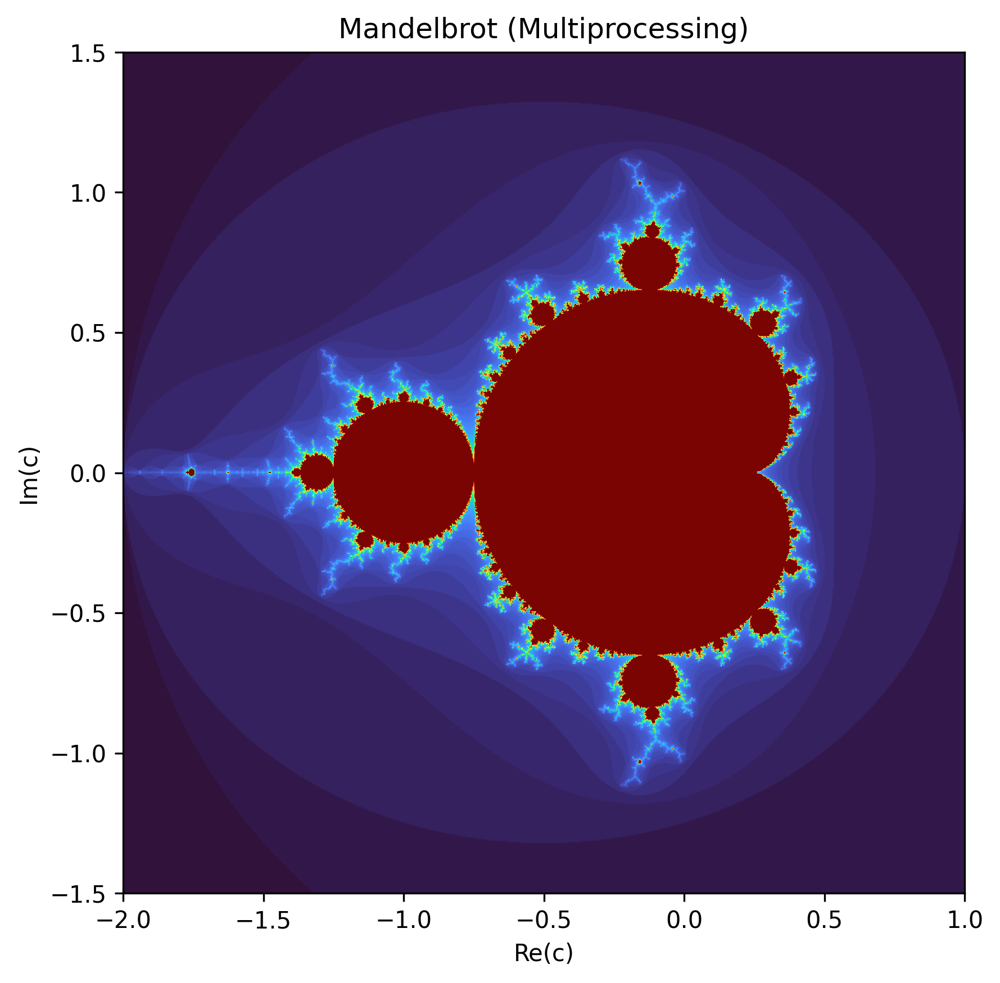
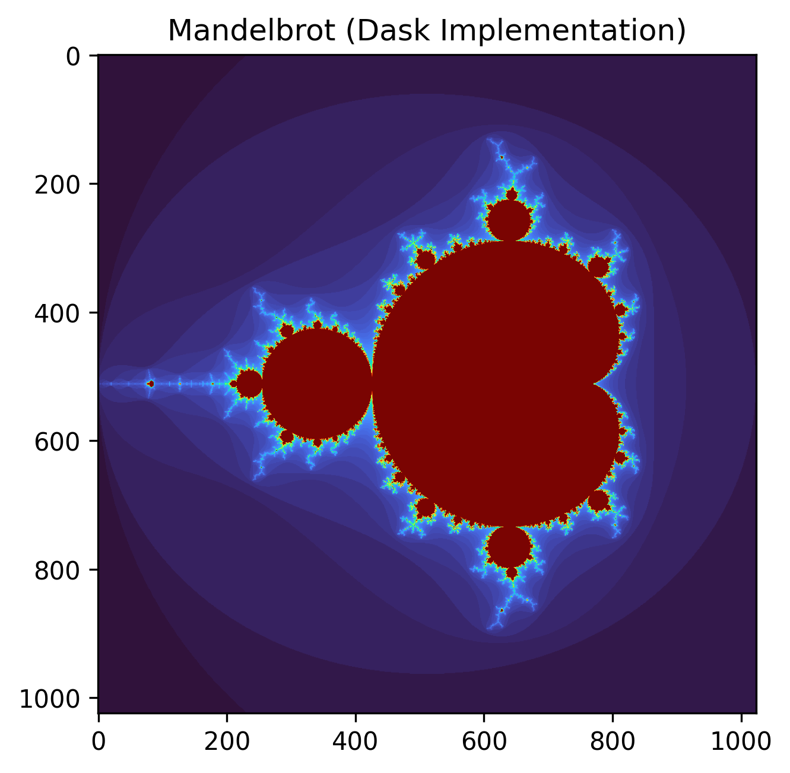

# Mini-Project II: Multi-processing and Dask
**Author:** Omkar Bhattarai
**Course:** Numerical Scientific Computing, Aalborg University
**Date:** March 2026

## 1. Problem Description
The Mandelbrot set is a famous fractal defined by the iterative formula $z_{n+1} = z_{n}^2 + c$. For each point $c$ in the complex plane, the sequence is computed starting from $z_0 = 0$. If the magnitude of $z$ remains bounded (specifically, $|z| \le 2$), the point belongs to the set. Computing this set for a high-resolution grid is computationally expensive, making it an ideal candidate for parallel processing. The objective of this project is to implement and evaluate parallelized versions of the algorithm using Python's `multiprocessing` module and the `dask` library.

## 2. Implementations
Three distinct approaches were implemented to analyze performance scaling:

1. **NumPy Vectorized (Baseline):** It is a highly optimized, purely vectorized NumPy implementation. To prevent unnecessary computations, it uses a boolean mask to track points that have not yet diverged, breaking out of the loop early if all points have escaped.
`Note: Numpy Vectorized implementation is repeated here, because it is necessary to compare how performance of implementations of multiprocessing and dask differ from it.`

2. **Multiprocessing:** Utilizes the `multiprocessing.Pool` to divide the complex grid into horizontal strips (chunks). Each worker process computes the iterations for its assigned strip using standard Python loops.

<b>Figure 2.1: Multiprocessing Implementation</b>

3. **Dask:** Utilizes `dask.array` to divide the grid into 2D blocks. Crucially, the `map_blocks` function is used to apply the optimized vectorized NumPy logic to each chunk atomically, minimizing Dask's scheduling overhead.

<b>Figure 3.1: Dask Implementation</b>

## 3. Benchmarking Methodology
To perform a comprehensive scaling analysis, the implementations were tested across increasing grid resolutions: 1024x1024, 2048x2048, and 4096x4096. 

* **Hardware & Environment:** The baseline, multiprocessing, and local Dask tests were executed locally. 
* **Multiprocessing Parameters:** Tested with 1 and 2 active workers, varying the number of chunks (2, 8, and 16 total chunks).
* **Dask Parameters:** Tested local multi-core execution using chunk sizes of (128, 128), (256, 256), and (512, 512) to find the optimal L2 cache fit.
* **Cluster Execution:** Dask was deployed in a distributed setup on the Strato cluster using a 3-terminal VS Code setup (scheduler and workers running 4 processes and 4 threads, utilizing 7.76 GiB of memory).

## 4. Experimental Results & Performance Analysis

### 4.1 Optimal Chunk Size Analysis
**Multiprocessing:** At the highest resolution (4096x4096) with 2 workers, dividing the workload into **8 total chunks** yielded the best execution time (37.62 seconds). 

**Dask:** For local execution, the **(256, 256)** chunk size consistently outperformed the others, achieving an execution time of 3.38 seconds at the 4096x4096 resolution. This suggests that a 256x256 complex array fits optimally within the CPU's cache on the test machine.

### 4.2 Speed-up Comparison
*The following table highlights the best times achieved for each method at the 4096x4096 resolution.*

<b>Table 4.2: Speed-up Comparison</b>

| Implementation | Time (seconds) | Speedup vs NumPy |
| :--- | :--- | :--- |
| NumPy Vectorized (Baseline) | 29.41s | 1.0x |
| Multiprocessing (2 workers, 8 chunks) | 37.62s | **0.78x** |
| Dask Distributed (Strato Cluster) | 10.87s | **2.71x** |
| Dask Local (256x256 chunks) | 3.38s | **8.69x** |

### 4.3 Reasoning and Interpretation
The most striking result is that the **Multiprocessing implementation is slower than the baseline (Speedup < 1)**. The NumPy baseline uses highly optimized, compiled C-code to efficiently compute the entire array. The multiprocessing version reverts to using nested Python `for` loops inside the worker functions. The overhead of native Python loops heavily outweighs the benefits of distributing the work across two cores.

The **Dask implementations**, however, achieved significant speedups by using `map_blocks` to apply the vectorized NumPy function atomically. 

Interestingly, **Local Dask (3.38s) was significantly faster than Distributed Dask on the Strato cluster (10.87s)**. During the cluster execution, Dask issued a warning: `Sending large graph of size 256.02 MiB`. When executing locally, worker processes share memory under the hood. In a distributed cluster, Dask must serialize this massive 256 MiB complex grid and send it over the network to the workers. For this specific problem size, the network communication bottleneck outweighed the computational power of the cluster, resulting in a lower speedup than local execution.

**Link to the Github Mini Project-II:**
[Github Repository Link](https://github.com/omkarbhattarai71/Numerical-Scientific-Computing/tree/main/Mini-Project-II)

