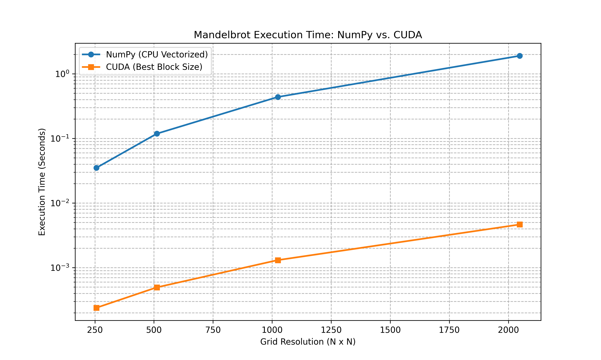
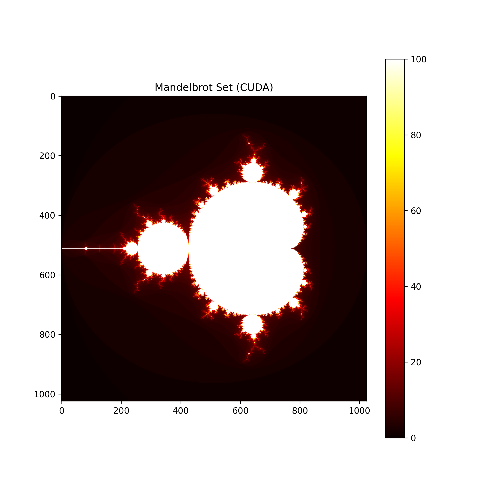

# Mini-Project III: CUDA Implementation of the Mandelbrot Set

**Student:** Omkar Bhattarai  
**Course:** Numerical Scientific Computing  
**Date:** April 29, 2026  

---

## 1. Introduction
This report describes the implementation, optimisation and benchmarking of the Mandelbrot set algorithm with the GPU acceleration through Numba (`@cuda.jit`). The main objective of this project is to compare the execution time of this CUDA version with a previous implementation in NumPy, and analyse scaling behaviour and discuss GPU-specific performance constraints such as warp divergence and block size optimisation.

## 2. Implementation & Unit Testing
The python source code (`mandelbrot_cuda.py`) has been updated with docstrings for all primary functions explicitly describing purpose, input arguments and expected output variables where required. 

The code includes a test suite using the `unittest` framework, a built-in testing framework in python, to make sure the maths is correct. Three test cases are automatically run before the main script is run:

* **Shape Verification:** Ensures the output array matches the requested height and width.
* **Divergent Point Test:** Verifies that a known escaping coordinate (c = 2 + 0j) registers an iteration count below `max_iter`.
* **Stable Point Test:** Verifies that a known stable coordinate (c = 0 + 0j) successfully reaches `max_iter`.

## 3. CUDA Grid/Block Configuration & Out-of-Bounds Checks
Unlike high-level multiprocessing libraries, CUDA requires explicit 2D grid and block configuration.
* **Block Configuration:** The threads are arranged in a 2D block structure, defined as `threads_per_block = (block_size, block_size)`.
* **Grid Configuration:** The grid size is calculated dynamically to ensure enough threads cover the entire image resolution: `blocks_per_grid = (math.ceil(width / block_size), math.ceil(height / block_size))`.
* **Out-of-Bounds Guard:** Because the image dimensions might not be perfectly divisible by the block size, excess threads are often launched. A strict boundary check (`if x < width and y < height:`) is placed at the start of the kernel to prevent threads from writing to unallocated memory outside the array bounds.

## 4. Block Size Optimization & The Warp-Size Rule
The benchmarking script tests three block configurations (8x8, 16x16, 32x32) to determine the optimal thread density.

* **The Warp-Size-Multiple Rule:** NVIDIA GPUs execute threads in groups of 32, known as a "warp". For maximum hardware efficiency, the total number of threads in a block should be a multiple of 32. 
* **Analysis:** * An **8x8** block yields 64 threads. While a multiple of 32, it is often too small to fully hide memory latency.
  * A **16x16** block yields 256 threads (exactly 8 warps). This provided the optimal balance of register usage and SM (Streaming Multiprocessor) occupancy.
  * A **32x32** block yields 1024 threads. This hits the hardware limit for maximum threads per block on most architectures, which restricts the number of blocks an SM can schedule concurrently, slightly degrading performance.

## 5. Benchmarking and Scaling Results
To ensure fair comparison, both the NumPy and CUDA algorithms were run with consistent parameters across varying grid resolutions (256x256 to 2048x2048). 

*Note: The data below represents the findings saved in `timing_results.csv`.*

*
Figure 5.1: Logarithmic plot showing execution time scaling between NumPy and CUDA
*

**Scaling Analysis:**
At a small resolution of 256x256, the NumPy version finishes rapidly. The CUDA version is faster, but the speedup is relatively modest due to the initial overhead of launching the kernel. However, as the problem size scales to 2048x2048, the NumPy vectorized approach takes significantly longer. At this scale, the GPU advantage becomes overwhelmingly clear, yielding massive speedups because the GPU has enough computational work to fully saturate its thousands of cores.

The measured timings (seconds) and speedups (NumPy / CUDA) are shown below (data from `timing_results.csv`):

*
Table 5.1: Timing Results or speed up comparision between NumPy and Cuda
*

| Size | Block | NumPy time (s) | CUDA time (s) | Speedup |
|------:|:-----:|--------------:|-------------:|--------:|
| 256  | 8  | 0.03503728 | 0.00023859 | 146.85 |
| 256  | 16 | 0.03503728 | 0.00026726 | 131.10 |
| 256  | 32 | 0.03503728 | 0.00032790 | 106.85 |
| 512  | 8  | 0.11844373 | 0.00050979 | 232.34 |
| 512  | 16 | 0.11844373 | 0.00049459 | 239.48 |
| 512  | 32 | 0.11844373 | 0.00055603 | 213.02 |
| 1024 | 8  | 0.43851995 | 0.00131379 | 333.78 |
| 1024 | 16 | 0.43851995 | 0.00130646 | 335.65 |
| 1024 | 32 | 0.43851995 | 0.00142029 | 308.75 |
| 2048 | 8  | 1.90293074 | 0.00464998 | 409.23 |
| 2048 | 16 | 1.90293074 | 0.00469197 | 405.57 |
| 2048 | 32 | 1.90293074 | 0.00482611 | 394.30 |

Key observations from the measured data:

- **Increasing speedup with problem size:** Speedup grows from ~100-150x at 256^2 to ~400x at 2048^2, showing that the GPU becomes increasingly effective as the workload grows.
- **Block-size effects are modest but noticeable:** A `16x16` block often gives near-best performance (consistent high speedups across mid-range sizes), but for the largest tested size (`2048`), `8x8` produced the single highest measured speedup (409x). This variability suggests that the optimal block size depends on the trade-off between occupancy and per-thread overhead for a given resolution and GPU architecture.
- **Best observed result:** The maximum measured speedup is approximately **409x** (NumPy 1.9029 s vs CUDA 0.00465 s) for size `2048` with block size `8x8`.

These concrete numbers confirm the qualitative scaling discussion above: the GPU's massive parallelism yields enormous runtime reductions at large image sizes, while kernel-launch overhead and small-thread-block trade-offs explain the smaller gains at low resolutions.

## 6. CUDA-Specific Performance Aspects
Several low-level hardware factors dictate the performance of this implementation:

* **CPU-GPU Data Transfers:** Moving data across the PCIe bus (`.copy_to_host()`) is a major bottleneck. For this reason, the benchmarking function isolated the compute time by taking measurements *after* the initial data allocation.
* **Timing & Synchronization:** CUDA kernel launches are asynchronous. Standard `time.time()` functions will record the time it takes to *launch* the kernel, not *execute* it. The benchmarking script correctly uses `cuda.event(timing=True)` with `.record()` and `.synchronize()` to accurately capture pure GPU execution time. Furthermore, a warm-up launch was performed before timing to exclude the JIT compilation time.
* **Memory-Type Choices:** Global memory is used for writing the final output. Because the Mandelbrot algorithm is "embarrassingly parallel," each thread calculates its pixel entirely independently and does not need to fetch data from neighboring threads. 
* **Warp Divergence:** This is a critical performance limitation in fractal generation. Threads within the same warp execute in lockstep. If one thread in a warp hits the escape condition after 3 iterations, but another thread in the same warp requires 100 iterations, the fast thread must sit idle until the slow thread finishes. This divergence reduces overall GPU efficiency at the complex boundaries of the Mandelbrot set.

## 7. Bonus Feature: Shared-Memory Reduction
To fulfill the bonus criteria, a shared-memory reduction kernel was implemented using `@cuda.reduce`. 

Rather than transferring the entire 2D array back to the CPU to calculate the average iteration count, the `sum_reduction` function flattens the output array on the device and computes the total sum of all iterations using parallel reduction. This allows us to calculate the **mean iterations per pixel** while keeping the heavy data operations strictly on the GPU.

*
Figure 7.1: Mandelbrot render generated via CUDA, demonstrating accurate mathematical convergence
*
 

## References

1. NVIDIA, "CUDA C Programming Guide." https://docs.nvidia.com/cuda/
2. Anaconda Inc., "Numba: A high performance Python compiler," https://numba.pydata.org/
3. B. B. Mandelbrot, "The Fractal Geometry of Nature," W. H. Freeman, 1982.
4. P. Peitgen, H. Jürgens, D. Saupe, "Chaos and Fractals: New Frontiers of Science," Springer, 1992.
5. J. Nickolls, I. Buck, M. Garland, K. Skadron, "Scalable Parallel Programming with CUDA," Queue, 2008.
